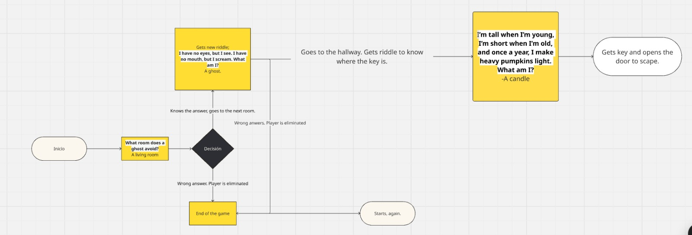

# 🕸️ Haunted Server: Java REST API Escape Room

## 🎯 Overview

This project challenges the team to design an **interactive Java REST API** that simulates an **escape room experience**.  
Players interact with the haunted digital world through **HTTP requests**, solving clues and riddles to “escape” from a cursed server.

The challenge tests:
- 🧩 Backend logic & reasoning
- 🤝 Teamwork & collaboration
- ✍️ Creative storytelling through REST endpoints

---




---
## 🧠 Concept

A **Java REST API** that behaves like a **digital escape room** was created.

Players begin **“trapped”** inside a haunted server and must solve a series of puzzles by sending the right HTTP requests to the corresponding endpoints.  
Each correct request reveals new narrative clues, riddles, or keys that allow progression to the next stage.

The goal: escape from the haunted server by collecting all keys and unlocking the final door.

---

## ⚙️ API Instructions

### 🧩 Example Flow

1. **GET `/room`**  
   → Returns the first clue and a brief room description.

2. **POST `/door`**  
   → Submits a **key** (via JSON body or query parameter) to unlock the next stage.

3. **GET `/hallway`**  
   → Returns a new clue and ambient description to move forward.

4. **POST `/escape`**  
   → Verifies if the user has collected all keys and escaped successfully.

---

## 🧾 Example JSON Response

```json
{
  "message": "The air turns cold... a faint click echoes in the dark.",
  "status": "door_unlocked"
}
```

---

## 🧱 Expected Structure

| Endpoint | Method | Description |
|-----------|---------|-------------|
| `/room` | GET | Returns the opening clue and sets the narrative context. |
| `/door` | POST | Receives a “key” and checks if it’s valid to unlock the next stage. |
| `/hallway` | GET | Provides a new riddle or clue to proceed. |
| `/escape` | POST | Final verification endpoint: confirms if the player escaped. |

---

## 💡 Development

- Implement each puzzle or riddle through **logic validation** on endpoints.
- Use **JSON-based storytelling**, combining narrative with gameplay.
- Design **clear status messages** like `door_locked`, `clue_revealed`, or `escaped_successfully`.
- Maintain **state tracking** (e.g., which keys the player has found).
- Optionally, add **extra challenges** (e.g., wrong key penalties, timed puzzles).

---

## 🧪 Example Testing Flow (Postman)

1. Send `GET /room` → read the narrative and get the first clue.
2. Use that clue to form the right key.
3. Send `POST /door` with the key → unlocks a new area.
4. Continue with `GET /hallway`.
5. Finish with `POST /escape` to verify if all steps were completed successfully.

---

## 🕯️ Narrative 

Ana and Annie are two little sisters who love Halloween, especially the candy. When their mom sends them out to go trick-or-treating, they couldn’t be happier. They knock on doors all night long, filling their bags with sweets and laughter, until they finally reach the old, creepy house at the end of the street.

“Wow, that house has amazing decorations!” Ana whispers, her eyes wide with excitement. Annie nods eagerly, clutching her candy bag a little tighter. Neither of them suspects the truth waiting inside.

Annie knocks gently on the door, but before she can knock again, it slowly creaks open on its own. Curious and fearless, the sisters step inside, thinking someone is playing a spooky Halloween prank. But the moment they cross the threshold, the door slams shut behind them and locks.

Silence fills the air. In front of them, a small table holds a single note with mysterious handwriting. It’s a riddle—one they must solve if they want to escape the haunted house.

```json
{
  "message": "A candle flickers... revealing a code etched on the wall: 'XK-42'.",
  "hint": "You might need this later...",
  "status": "clue_revealed"
}
```
aaegrgesgaeg
---

## 🧙‍♂️ Objective

API should:
- Run on a local or hosted Java environment.
- Contain at least **4 REST endpoints** with sequential puzzle logic.
- Return **JSON-formatted narrative feedback**.
- Demonstrate teamwork, creativity, and software design principles.
